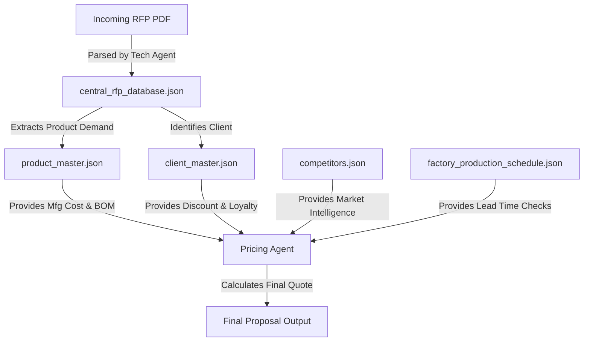

# 📊 Techathon Problem Statement 4: Database Analysis & Schema

## Overview
This document provides a comprehensive analysis of the **JSON-based Mock Database System** designed for the **AI Sales Agent**. The database simulates a real-world ERP environment for an FMCG/Infrastructure company (like Asian Paints or Polycab), enabling the AI agents to perform complex tasks such as **technical parsing**, **pricing estimation**, **competitor analysis**, and **margin optimization**.

## 🗄️ Database Structure

The system is composed of **5 Core Master Databases** and **1 Transactional Database**:

| Database File | Type | Purpose | Key Entities |
| :--- | :--- | :--- | :--- |
| **`product_master.json`** | Master | Catalog of all active SKUs, technical specs, and commercial costs. | `product_id`, `mfg_cost`, `stock` |
| **`client_master.json`** | Master | Customer profiles, including loyalty tiers and payment terms. | `client_id`, `tier`, `loyalty_status` |
| **`competitors.json`** | Master | Intelligence on market rivals, their aggression, and win rates. | `competitor_id`, `pricing_intelligence` |
| **`factory_production_schedule.json`** | Operational | Real-time status of production lines to estimate delivery timelines. | `line_id`, `utilization_%`, `status` |
| **`central_rfp_database.json`** | Transactional | The central repository for all incoming tenders and their processing state. | `rfp_id`, `processing_stage`, `output` |

---

## 🔗 Data Relationships & Flow

The AI Sales Agent orchestrates data flow across these files to generate a winning proposal.

---

## 📂 Detailed File Analysis

### 1. Product Master (`product_master.json`)
The backbone of the system. It enables the **Technical Agent** to map vague RFP requirements to specific internal SKUs and allows the **Pricing Agent** to calculate base costs.

*   **Key Fields**:
    *   `product_id`: Unique SKU identifier (e.g., `PC-LT-AL-3.5C-400`).
    *   `technical_specs`: Granular details (Voltage, Insulation, Standards) for 100% accurate matching.
    *   **`commercial.base_mfg_cost_per_meter`**: The critical input for cost-plus pricing.
    *   `inventory_stock`: Used to determine if immediate supply is possible.

### 2. Client Master (`client_master.json`)
Allows for **personalized pricing strategies**. A "Tier-1" client might get better terms than a one-time buyer.

*   **Key Fields**:
    *   `tier`: e.g., "Tier-1 (Infrastructure Major)" vs "Tier-3 (Local Contractor)".
    *   `loyalty_status`: Gold/Silver/Bronze stats influence dynamic discounts.
    *   `payment_terms`: Critical for cash flow analysis (e.g., "Advance" vs "90 Days Credit").

### 3. Competitor Intelligence (`competitors.json`)
This unique database allows the agent to **apply Game Theory** to pricing. If a known aggressive competitor is active in a region, the AI lowers the margin to compete.

*   **Key Fields**:
    *   `colliding_internal_skus`: Which of our products they compete against.
    *   `pricing_intelligence.aggression_score`: 1-10 scale of how likely they are to undercut.
    *   `win_rate_against_us`: Historical data to adjust probability of winning.

### 4. Factory Production Schedule (`factory_production_schedule.json`)
Enables **Logical Delivery Dates**. Instead of promising standard lead times, the agent checks actual machine load.

*   **Key Fields**:
    *   `line_type`: Matches product category (e.g., "High Voltage Line").
    *   `utilization_percent`: If >90%, the agent automatically adds buffer time to the quote.
    *   `notes`: specific constraints like "Maintenance Due".

### 5. Central RFP Database (`central_rfp_database.json`)
Stores the **Lifecycle of a Tender**. It tracks the progression from raw PDF to final bid.

*   **Key Fields**:
    *   `processing_stage_tracker`: Tracks status of Sales, Tech, and Pricing agents (Pending/Completed).
    *   `sales_agent_output.summary`: Extracted metadata (Deadline, EMD Amount).
    *   `line_items_extracted`: The structured result of the Technical Agent's parsing.

---

## 🚀 Strategic Value for Problem Statement 4

This data architecture directly supports the Techathon goals:

1.  **Automation**: No manual lookup of costs or stock.
2.  **Intelligence**: Competitor and Client data drive **smart pricing**, not just formulaic pricing.
3.  **Accuracy**: linking RFPs to specific `product_ids` ensures detailed specs are never missed.
4.  **Scalability**: The modular JSON structure can easily be migrated to SQL/NoSQL databases.
