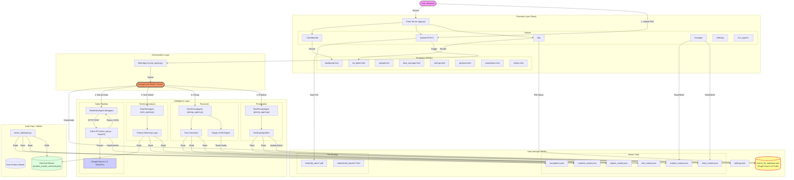

# System Architecture

```mermaid
graph TD
    %% ==========================================
    %% 1. USER INTERFACE LAYER
    %% ==========================================
    User([User / Browser])
    
    subgraph "Frontend Layer (Flask)"
        direction TB
        AppPY["Flask Server (app.py)"]
        
        subgraph "Routes"
            R_Dash["/ (Dashboard)"]
            R_Upload["/upload (POST)"]
            R_View["/rfp/<id>"]
            R_Manage["/manage/<file>"]
            R_Settings["/settings"]
            R_Agent["/run_agent/..."]
        end
        
        subgraph "Templates (HTML)"
            T_Dash[dashboard.html]
            T_Detail[rfp_detail.html]
            T_Up[upload.html]
            T_Data[data_manager.html]
            T_Set[settings.html]
            T_Prod[products.html]
            T_Comp[competitors.html]
            T_Client[clients.html]
        end
    end

    %% ==========================================
    %% 2. ORCHESTRATION LAYER
    %% ==========================================
    subgraph "Orchestration Layer"
        MainAgent["MainAgent (main_agent.py)"]
        BgThread([Background Worker Thread])
    end

    %% ==========================================
    %% 3. INTELLIGENCE (AGENT) LAYER
    %% ==========================================
    subgraph "Intelligence Layer"
        direction TB
        
        subgraph "Sales Pipeline"
            SalesAgent["RealSalesAgent (Wrapper)"]
            SalesAPI["Sales API (sales_api.py - FastAPI)"]
            Gemini["Google Gemini 1.5 Flash/Pro"]
        end
        
        subgraph "Technical Analysis"
            TechAgent["RealTechAgent (tech_agent.py)"]
            Matcher["Product Matching Logic"]
        end
        
        subgraph "Financials"
            PricingAgent["RealPricingAgent (pricing_agent.py)"]
            CostCalc["Cost Calculator"]
            MarginCalc["Margin & Bid Engine"]
        end
        
        subgraph "Prioritization"
            PriorityAgent["RealPriorityAgent (priority_agent.py)"]
            Ranker["Ranking Algorithm"]
        end
    end

    %% ==========================================
    %% 4. DATA PREPARATION LAYER
    %% ==========================================
    subgraph "Data Prep / Utilities"
        EnrichScript["enrich_database.py"]
        RawMaster[("Raw Product Master")]
        EnrichedMaster[("Enriched Master\n(product_master_enriched.json)")]
    end

    %% ==========================================
    %% 5. DATA PERSISTENCE LAYER
    %% ==========================================
    subgraph "Data Storage (JSON)"
        CentralDB[("central_rfp_database.json\n(Single Source of Truth)")]
        SettingsJSON[settings.json]
        
        subgraph "Master Data"
            M_Product["product_master.json"]
            M_Client["client_master.json"]
            M_Comp["competitors.json"]
            M_Mat["material_master.json"]
            M_Log["logistic_master.json"]
            M_Test["test_master.json"]
        end
        
        subgraph "File Storage"
            PDFs["/static/rfp_docs/*.pdf"]
            Reports["/static/audit_reports/*.html"]
        end
    end

    %% ==========================================
    %% CONNECTIONS & FLOWS
    %% ==========================================
    
    %% User -> App
    User -->|Access| AppPY
    AppPY --> R_Dash
    AppPY --> R_Upload
    AppPY --> R_View
    
    %% Routes -> Templates
    R_Dash -->|Render| T_Dash
    R_View -->|Render| T_Detail
    
    %% Upload Flow
    User -->|1. Upload PDF| R_Upload
    R_Upload -->|Save File| PDFs
    R_Upload -->|Trigger| MainAgent
    
    %% Orchestration
    MainAgent -->|Spawn| BgThread
    BgThread -->|Coordinator| CentralDB
    
    %% Step 1: Sales
    BgThread -->|1. Extract Data| SalesAgent
    SalesAgent -->|HTTP POST| SalesAPI
    SalesAPI -->|Prompt| Gemini
    SalesAPI -->|Map/Sanitize| M_Log
    SalesAPI -->|Return JSON| SalesAgent
    
    %% Step 2: Tech
    BgThread -->|2. Tech Match| TechAgent
    TechAgent --> Matcher
    Matcher -->|Read| EnrichedMaster
    Matcher -->|Read| M_Comp
    Matcher -->|Read| M_Test
    
    %% Step 3: Pricing
    BgThread -->|3. Pricing| PricingAgent
    PricingAgent --> CostCalc
    CostCalc -->|Read| M_Mat
    CostCalc -->|Read| M_Log
    CostCalc -->|Read| M_Test
    PricingAgent --> MarginCalc
    MarginCalc -->|Read Config| SettingsJSON
    
    %% Step 4: Priority
    BgThread -->|4. Prioritize| PriorityAgent
    PriorityAgent --> Ranker
    Ranker -->|Read| M_Client
    Ranker -->|Read| SettingsJSON
    Ranker -->|Update Ranks| CentralDB
    
    %% Data Prep Flow
    EnrichScript -->|Read| M_Product
    EnrichScript -->|Read| M_Mat
    EnrichScript -->|Read| M_Comp
    EnrichScript -->|Write| EnrichedMaster
    
    %% App -> Data
    R_Manage -->|Read/Write| M_Product
    R_Manage -->|Read/Write| M_Client
    R_View -->|Poll Status| CentralDB
    
    %% Styling
    style User fill:#f9f,stroke:#333
    style BgThread fill:#f96,stroke:#333,stroke-width:2px
    style CentralDB fill:#ff9,stroke:#f66,stroke-width:4px
    style Gemini fill:#ccf,stroke:#333
    style EnrichedMaster fill:#dfd,stroke:#333
```
